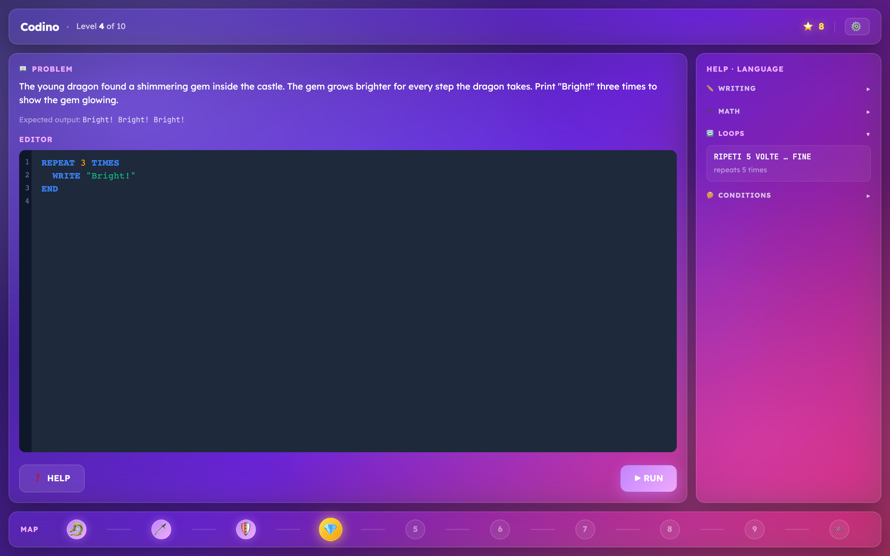

# Codino

> A coding game for 7- and 8-year-olds, built around the kid's own story.



## ▶ Play it now

**[https://acaprari.github.io/codino/](https://acaprari.github.io/codino/)**

You'll need your own Anthropic API key (the $5 free tier covers a full playthrough; expect about $0.10–0.20 per adventure). Add it once in Settings — it stays in your browser's localStorage and is never sent anywhere except directly to Anthropic.

## What it is

Codino teaches programming fundamentals — variables, math, loops, conditionals — to children who can read but can't yet code. Two ideas drive the design:

- **The kid writes their own story.** One or two sentences ("a brave dragon explores an enchanted castle"). The AI uses that story to generate a 10-level adventure where every problem is themed around what the kid wrote.
- **Real text-based code, not blocks.** Children type actual programs in a small bilingual language (Italian and English keywords, switchable on the fly). After each level the AI rates their solution 1–3 stars and writes a narrative bridge into the next level.

Other things worth knowing:

- After each level the child picks one of 2–4 story "elements" (a sword, a wand, a wolf…) that shape the next problem — the adventure branches.
- 100% frontend, no backend, no accounts, no cloud saves. Progress lives in `localStorage`.
- Desktop or laptop only — a real keyboard is required.

## How to play

1. Open [the live app](https://acaprari.github.io/codino/).
2. Click ⚙️ Settings and paste your Anthropic API key ([get one here](https://console.anthropic.com/)).
3. Type a one-or-two-sentence story (or hit "Give me ideas 💡") and start the adventure.

## A spec-driven development experiment

Codino is also a personal experiment in **spec-driven development**: `specs/` is the source of truth, and code is treated as a derivative. Every capability — the map, the editor, the execution pipeline, onboarding — has a markdown spec listing the decisions and invariants that govern it. Before any change to that area, the spec is read; after the change, the spec is updated in the same commit. Architectural decisions land in `specs/adr/`.

To enforce the discipline alongside an AI pair-programmer, I wrote a set of Claude Code skills — `spec:core`, `spec:bootstrap`, `spec:maintain`, `spec:capture`, `spec:infer`, `spec:validate` — that gate code changes on spec presence and reconcile drift. They live in their own repo:

**[github.com/acaprari/specdriven-skills](https://github.com/acaprari/specdriven-skills)**

The verdict so far is promising. The full Aurora workspace redesign ([ADR-001](specs/adr/ADR-001-single-workspace-redesign.md)) was carried out with the AI doing most of the editing, kept honest by specs that pinned every visible invariant. See [`CLAUDE.md`](CLAUDE.md) for the project-side workflow, [`specs/README.md`](specs/README.md) for the spec index.

## The Codino language

A short, bilingual language with keywords children can pronounce. Italian and English are interchangeable per session; switch in Settings.

```codino
apples = 5
pears = 3
total = apples + pears
WRITE "Fruit:", total

REPEAT 3 TIMES
  WRITE "Hello!"
END

REPEAT i FROM 1 TO 5
  WRITE i
END

IF total > 7
  WRITE "Many!"
ELSE
  WRITE "Few"
END

IF total EVEN
  WRITE "even total"
END
```

The Italian equivalents are `SCRIVI`, `RIPETI … VOLTE … FINE`, `RIPETI … DA … A … FINE`, `SE … ALTRIMENTI … FINE`, with `PARI`/`DISPARI` for even/odd. Full reference: [`docs/USER_GUIDE.md`](docs/USER_GUIDE.md).

## Under the hood

- Custom **Lezer** grammar + a small tree-walking interpreter for the Codino language. Execution is recorded as a sequence of steps that the UI then animates line-by-line (1.5 s per step) so kids can watch variables update.
- **CodeMirror 6** for the editor — syntax highlighting, autocomplete, inline error markers.
- **Anthropic Claude** is called directly from the browser for five things: map generation, problem generation, hints, code rating, and story-idea suggestions. Sonnet for the heavier prompts, Haiku for error explanations. Per-level prompts are *prescriptive* — each level names the construct the generated problem must exercise, so condition-teaching levels actually require conditions instead of dodging into arithmetic. See [ADR-002](specs/adr/ADR-002-language-revision-and-prescriptive-gating.md) for the architectural shift.
- **Zustand** for the single global store; **localStorage** is the only persistence layer.
- Validation is exact-match-after-trim on the printed output. Wrong output routes to a Haiku-generated explanation modal; correct output triggers Sonnet rating + a branch-pick popup.

## Development

**Stack:** React 19 + TypeScript + Vite, Tailwind, CodeMirror 6 + Lezer, Zustand, Anthropic SDK. Node 20+ required.

```bash
git clone https://github.com/acaprari/codino.git
cd codino
npm install
npm run dev          # http://localhost:5173
```

Optional: drop `VITE_ANTHROPIC_API_KEY=...` into `.env.local` so you don't have to enter the key through Settings each time.

| Command | What it does |
|---|---|
| `npm run dev` | Vite dev server with HMR |
| `npm run build` | Production build to `dist/` |
| `npm run preview` | Serve the production build locally |
| `npm test` | Vitest unit tests |
| `npm run test:e2e` | Playwright end-to-end tests |
| `npm run build:grammar` | Regenerate the Lezer parser after editing `codino.grammar` |

### Project layout

```
src/
  features/          # aurora/, editor/  — UI surfaces
  core/              # language/ (Lezer + interpreter), api/ (Claude client), codemirror/
  store/             # Zustand store + localStorage persistence
  components/        # shared aurora UI primitives (GlassPane, Label, AuroraButton…)
  types/             # shared TS types
specs/               # the source of truth — capability specs, ADRs, invariants
docs/                # USER_GUIDE.md and other user-facing docs
tests/               # unit/ (Vitest) and e2e/ (Playwright)
```

Before contributing, read [`specs/README.md`](specs/README.md) and the capability spec for whatever you're touching — then [`CONTRIBUTING.md`](CONTRIBUTING.md) for the workflow.

## License

MIT — see [LICENSE](LICENSE).

---

Made with love for young coders ✨
